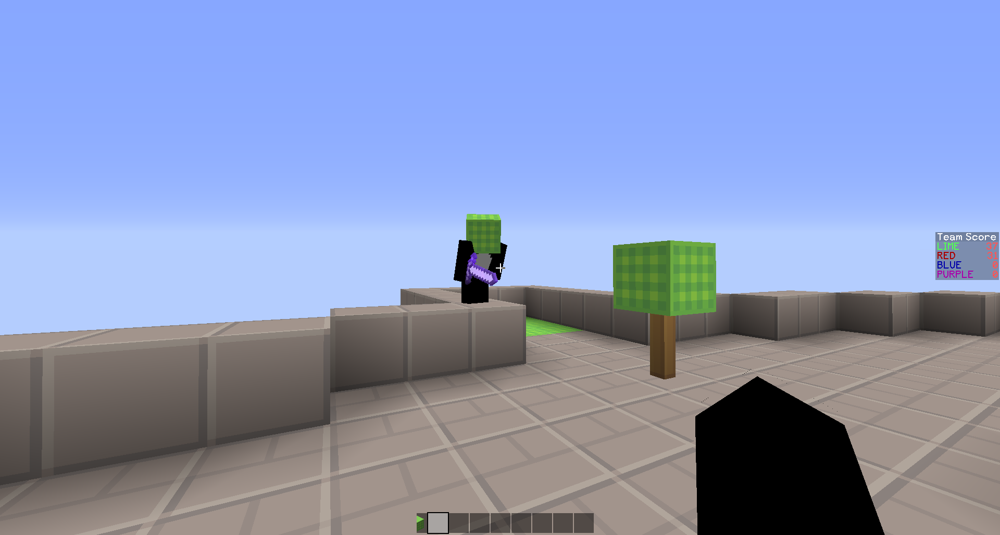

TranceTeams
-------

TranceTeams is a team pvp plugin for post 1.8 servers.

Team creation is fully dynamic and scores persist across restarts. A scoreboard shows live team scores. New players will be placed in the least populated team on join, as well as receive a fancy wool block hat based on their team color.

### Permissions

- `tranceteams.user`	Nearly every user playing the game
- `tranceteams.op`	Gives access to /teamadmin commands

### Administration

- `/teamadmin broadcast`	A debug command, showing all created teams and members
- `/teamadmin save`	Force all teams to persist to config. Should only ever be run after using *setspawn* and *setasset*

The following commands must be run while holding the color wool block of the team you wish to modify in your hand

- `/teamadmin create`	Create a new team
- `/teamadmin setspawn`	Set the team spawn for a team
- `/teamadmin setasset`	Set the asset for the color wool block in hand, your cursor should be focuses on the block you wish to use

### Configuration Options

- `respawnDelay`	The number of seconds to wait before re-spawning an asset
- `assetHardness`	The number of block breaks it takes to capture an asset